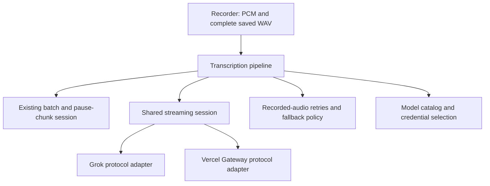

# Streaming transcription implementation plan

The Windows app already streams Grok audio in `XaiStreamingSession`. Its
`ITranscriptionSession` interface is the right seam for recording, but the
engine, settings and History currently assume every streaming model uses
xAI credentials, Grok dictionary limits and the xAI batch retry endpoint.
Adding MAI to `IsStreaming` alone would select the wrong behavior in all three.

## Design

Keep the existing recording interface. Add one shared streaming module under
`src/LocalWhisper/Streaming`. It owns the PCM queue, ordered writes, concurrent
reads, connection and finalization deadlines, cancellation, failure state,
socket disposal and timing. Capture callbacks enqueue without waiting on
network work. Bound queued audio by bytes; overflow fails the session and
retains the recording for fallback rather than dropping audio.

Two protocol adapters satisfy an internal interface. Grok configures its
Bearer-authenticated WebSocket, waits for `transcript.created`, and assembles
locked partials plus the optional final tail. Vercel configures its credential
subprotocol, sends the Gateway start frame, and uses authoritative `finish.text`.
Both send raw 16 kHz mono signed 16-bit PCM. Each adapter owns its framing,
provider events and model cost estimate. Transport injection allows lifecycle
tests without an actual microphone, credential or network connection.

Move provider selection into `TranscriptionPipeline`, which creates the
session and recorder mode, executes saved recordings, and supplies available
models to the existing fallback policy. `EngineApp` continues to own capture,
cleanup, paste and History. It should not know WebSocket protocols or use
`IsStreaming` to select credentials or dictionary validation.

Use a model catalog for display label, credential requirement, streaming mode,
dictionary support/limits and support for parallel MAI requests. Send these
definitions to Electron through settings so selection and availability do not
need independent provider conditionals in the renderer. Keep persisted model
IDs compatible and add `mai-transcribe-2-streaming` as a distinct choice.

Store the Vercel key separately with the existing Windows account encryption.
The production app reads encrypted settings or `AI_GATEWAY_API_KEY`; the
benchmark's `.env.local` remains a development credential source. Import the
existing development key into encrypted local settings without printing it
when making the integration ready for this workstation.

## Behavior

Start the connection when recording starts and buffer initial PCM while it
connects. Keep the full recording independently for recovery. Finish drains
the queued PCM, sends exactly one end-of-input message and waits for the
provider's completed transcript. Cancel aborts both reads and writes, closes
the connection and does not initiate fallback or paste provisional text.
Repeated Finish calls share the same completion task.

MAI streaming does not claim clean/verbatim or dictionary-hint support.
Keep dictionary contents saved and explain in Settings that this selection
does not send them as recognition hints. Pause chunking and parallel batch
requests are unavailable for streaming. Luna cleanup remains optional and
requires its own OpenRouter key. Paste uses only the completed transcript.

Retry and alternate-transcript requests must respect the chosen model.
MAI streaming replays decoded saved audio through the same streaming module;
it must not quietly switch to batch MAI. Retain Grok's existing explicit
batch recovery behavior. After a live MAI streaming failure, try available
existing batch models and then Grok recovery, record the actual model used,
and preserve the recording if recovery also fails. Do not restart an already
failed live stream as the first automatic fallback.

Record connection, audio transmission and finalization timings, plus first
transcript timing, so History can distinguish setup from response delay.
Keep requested and used model IDs separate. Provider cost estimates remain
duration estimates; the gateway dashboard is the source for actual billing.
Credential-bearing subprotocols and provider error payloads must not enter
History or diagnostics.

## Implementation order

1. Add catalog definitions and separate encrypted Gateway credentials.
2. Implement the shared transport/session and move Grok into its adapter.
3. Add the Vercel adapter using the verified Gateway protocol.
4. Route live capture, saved recordings and fallback through the pipeline.
5. Update Settings, comparison selection and History labels from the catalog.
6. Test protocol contracts and lifecycle failures offline; build the engine
   and run existing engine and desktop tests. Do not run paid benchmarks.

Tests should cover exact PCM preservation, queued audio during connect, tail
flush, duplicate Finish, partial replacement, authoritative completion, close
before completion, connection/finish timeout, midstream errors, bounded queue
overflow, cancellation, saved-audio replay and fallback model identity.

This implementation targets Windows. Android's recording and transcription
module is separate Kotlin code and needs a later implementation of the same
behavioral contracts. Existing unrelated work in the repository stays intact.

Protocol facts and limitations are documented with primary sources in
[Vercel MAI streaming research](vercel-mai-streaming-research.md).

## Implemented result

The plan is implemented in `StreamingSession`, `StreamingTransport`,
`GrokStreamingProtocol`, `GatewayStreamingProtocol`, `TranscriptionPipeline`
and `TranscriptionModels`. The old standalone `XaiStreamingSession` was
removed. Electron consumes the engine's model definitions for Settings and
alternate transcript choices. MAI streaming cost estimates survive an
OpenRouter activity import because they belong to a different billing source.

The Gateway key from the local benchmark env file has been saved to this
workstation's encrypted Windows settings. Existing model selection is retained.
After rebuilding and restarting the Windows app, choose
`MAI-Transcribe-2 · Streaming` in Settings and save. Keep cleanup off to use
only the Gateway key, or supply an OpenRouter key for Luna cleanup.

Verification uses offline protocol and lifecycle tests, the engine build and
IPC smoke test, desktop unit tests and Electron UI smoke tests. No paid
benchmarks were run for the integration. The earlier SDK smoke test confirmed
Gateway account access; the new native .NET transport still needs a manual
dictation check in the rebuilt app.
